# MSSQLUtils
Утилита для MS SQL базы данных:
1. Пакетная обработка процедур

Если необходимо произвести изменения в нескольких десятках-сотнях процедур нажатием одной кнопки, например заменить GETDATE() на GETUTCDATE()
		

		  
Скриншоты

			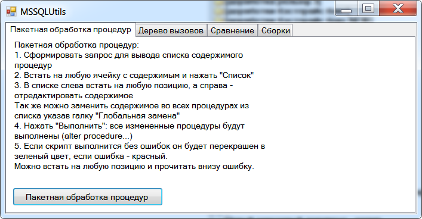
			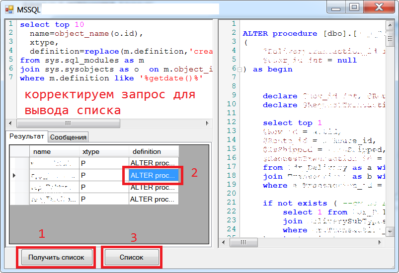
			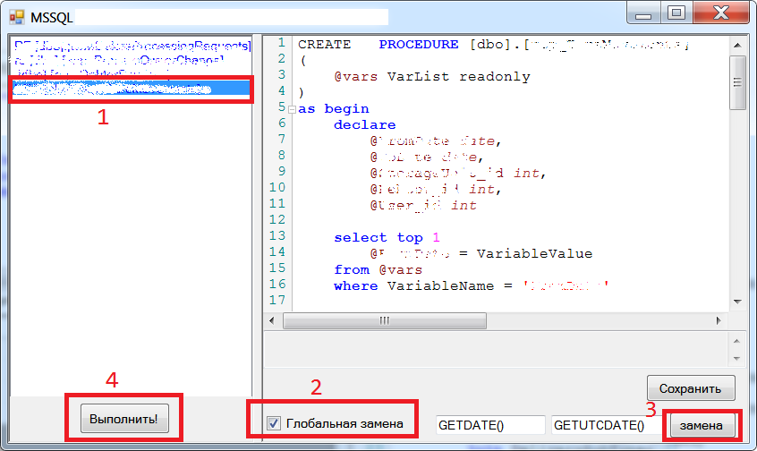
			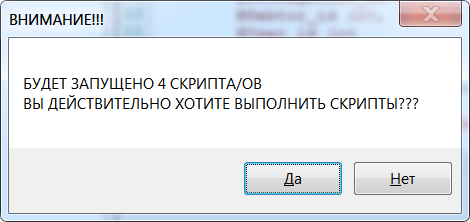
		

2. Дерево вызовов

Если необходимо построить в древовидном виде список зависимых процедур.
Можно искать как "вниз" (app_proc1 -> app_proc2 -> ...) так и "вверх" (app_proc2 -> app_proc1, app_proc3 -> app_proc1)
		

		  
Скриншоты

			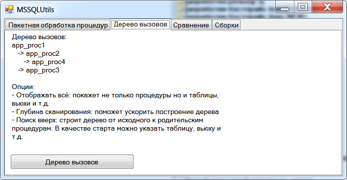
			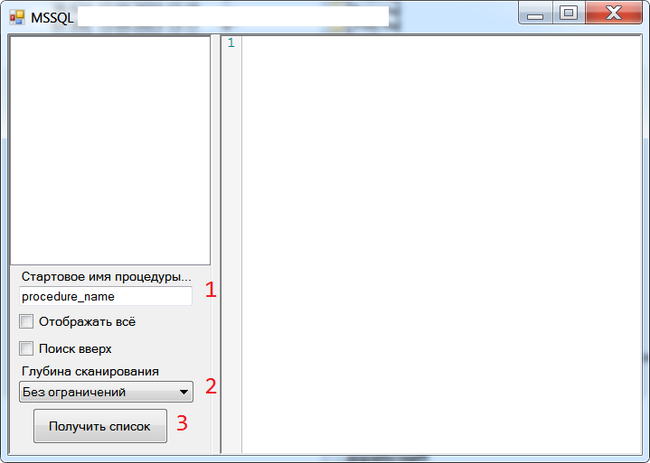
			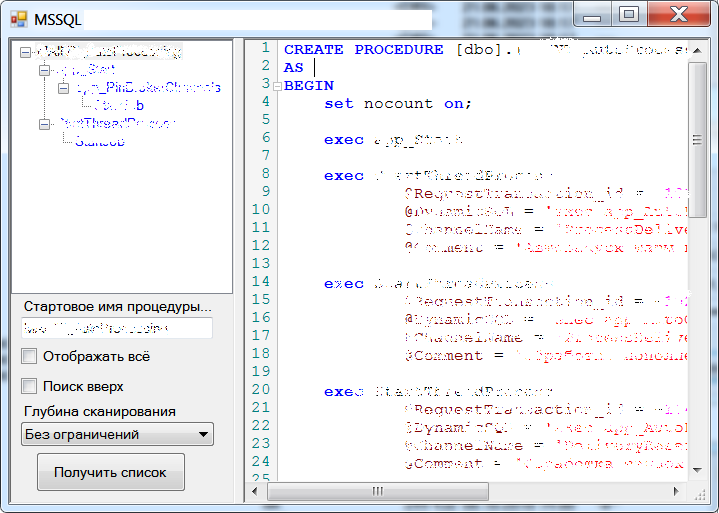
			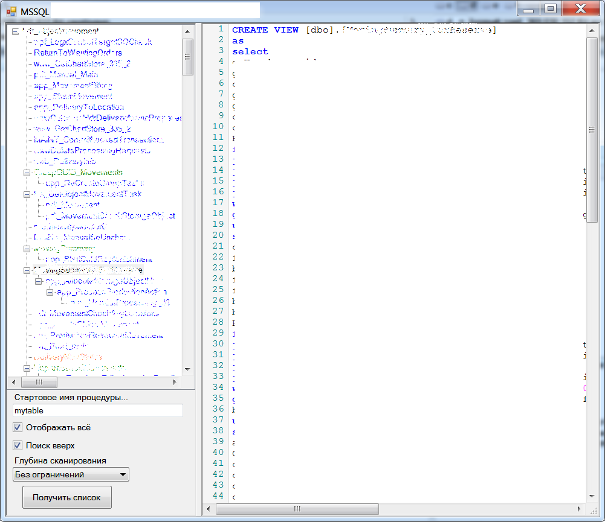
		

3. Сравнение процедур/функций/view между собой в пределах разных баз данных.
		

		  
Скриншоты

			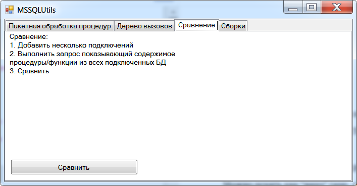
			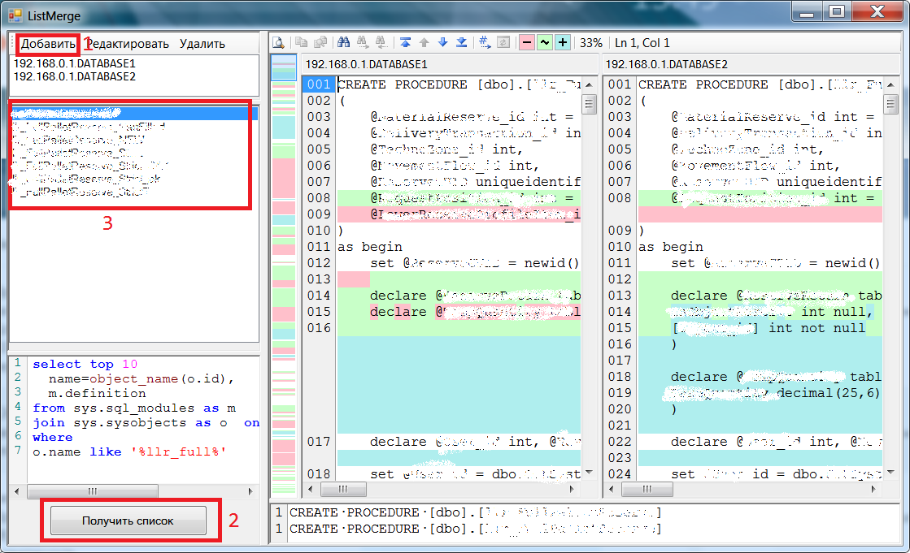
		

4. Просмотр содержимого сборок на c# языке
		

		  
Скриншоты

			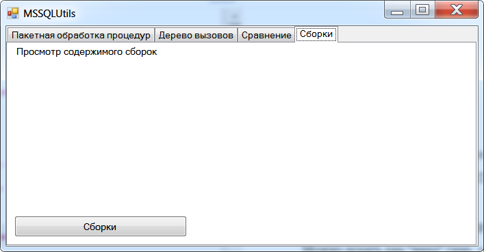
			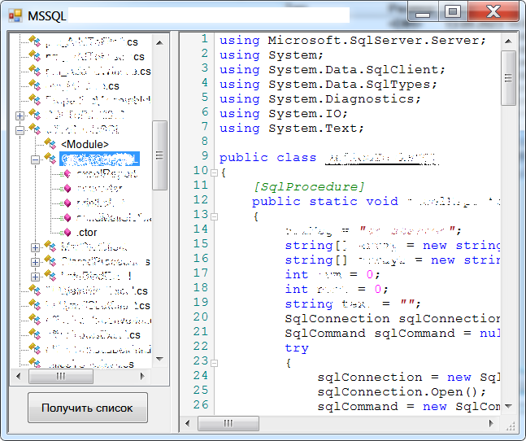
		

# Используемые компоненты:
- FCTB - FastColoredTextBox для подсветки синтаксиса
- Menees - для декомпиляции сборок
- Microsoft.SqlServer.Management.SqlParser - для парсинга SQL запросов

# Средство разработки
SharpDevelop 5.1